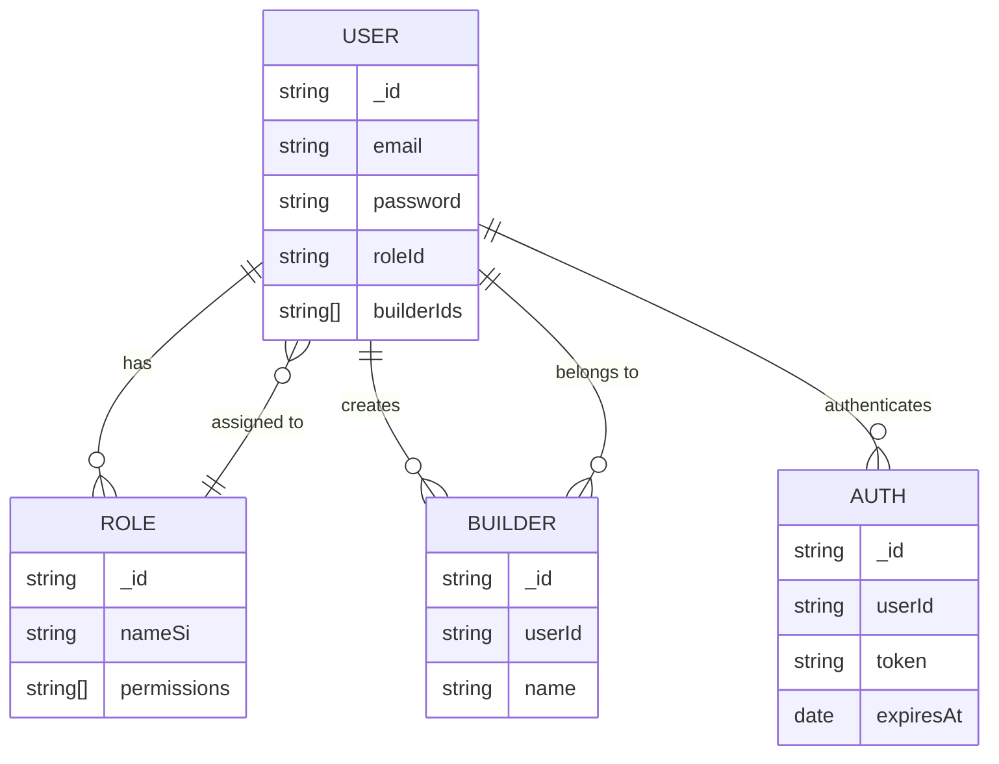

# Diagrama de Relaciones de Entidades (ERD)

Este diagrama describe las relaciones principales entre las entidades del backend de AdaptCV.

```mermaid
erDiagram
    USER {
        string _id
        string email
        string password
        string roleId
        string[] builderIds
    }
    ROLE {
        string _id
        string nameSi
        string[] permissions
    }
    AUTH {
        string _id
        string userId
        string token
        date expiresAt
    }
    BUILDER {
        string _id
        string userId
        string name
    }

    USER ||--o{ ROLE : "has"
    USER ||--o{ BUILDER : "creates"
    USER ||--o{ AUTH : "authenticates"
    ROLE ||--o{ USER : "assigned to"
    BUILDER }o--|| USER : "belongs to"
```
